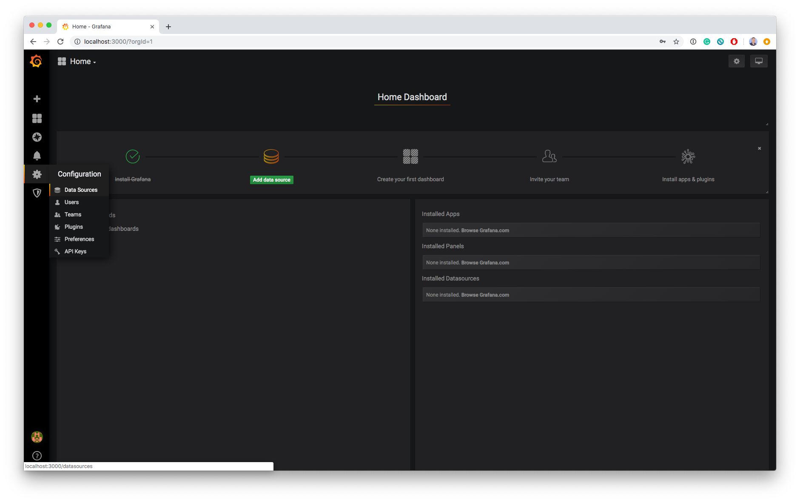
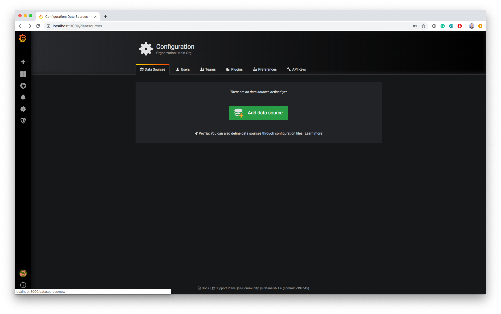
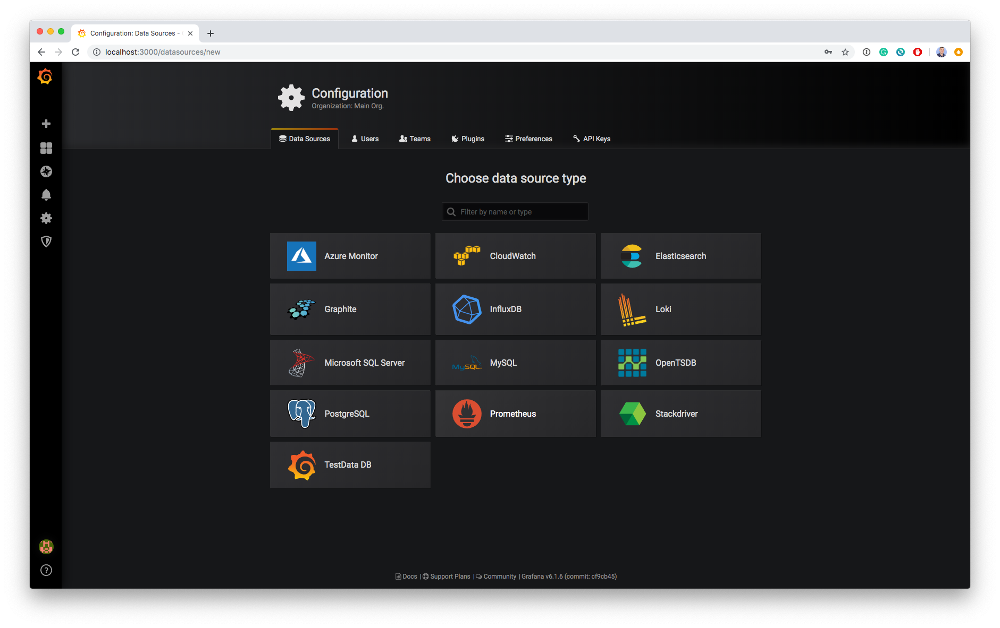
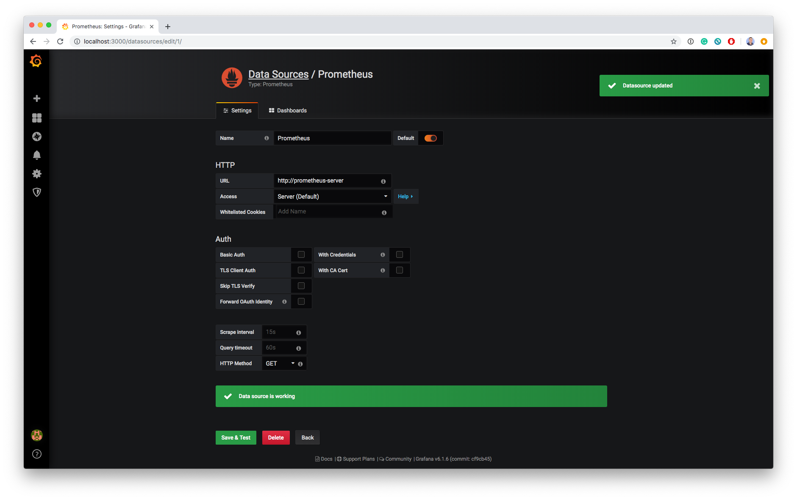
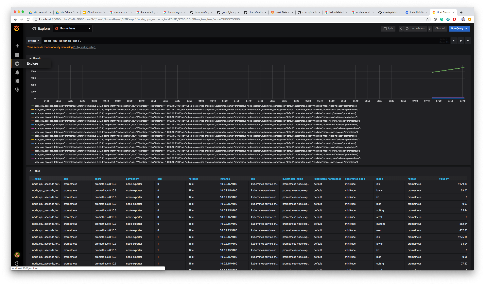

# Prometheus 101 demo

This is a simple demo on how to get started playing with Prometheus and Grafana locally in Kubernetes


## Getting a cluster
There's plenty of different options for setting up a cluster. In this guide/demo we will use `minikube`.

Follow the instructions here: https://kubernetes.io/docs/tasks/tools/install-minikube/

## Installing helm
In order to get things set up quickly we will be using `helm`.

Follow the instructions here to install `helm`: https://github.com/helm/helm

Initialize `helm` by calling `init`. This installs a service in the `minikube` cluster called `tiller` used by the `helm` client to interact with the kubernetes api.
```
$ helm init
```

## Installing Prometheus

Next, we install `prometheus`. It is as simple as:

```
$ helm install stable/prometheus --name prometheus
```

The output of this command:

```
$ kubectl get pods
NAME                                             READY     STATUS    RESTARTS   AGE
prometheus-alertmanager-6db559d695-kfw95         2/2       Running   0          3m54s
prometheus-kube-state-metrics-5db7466b57-jm9v7   1/1       Running   0          3m54s
prometheus-node-exporter-xljv2                   1/1       Running   0          3m54s
prometheus-pushgateway-59bd88779d-clrnh          1/1       Running   0          3m54s
prometheus-server-5f74c4749-xbrrk                2/2       Running   0          3m54s
```

`helm` will also output a list of notes on how you access the different services: 
```
NOTES:
The Prometheus server can be accessed via port 80 on the following DNS name from within your cluster:
prometheus-server.default.svc.cluster.local


Get the Prometheus server URL by running these commands in the same shell:
  export POD_NAME=$(kubectl get pods --namespace default -l "app=prometheus,component=server" -o jsonpath="{.items[0].metadata.name}")
  kubectl --namespace default port-forward $POD_NAME 9090


The Prometheus alertmanager can be accessed via port 80 on the following DNS name from within your cluster:
prometheus-alertmanager.default.svc.cluster.local


Get the Alertmanager URL by running these commands in the same shell:
  export POD_NAME=$(kubectl get pods --namespace default -l "app=prometheus,component=alertmanager" -o jsonpath="{.items[0].metadata.name}")
  kubectl --namespace default port-forward $POD_NAME 9093


The Prometheus PushGateway can be accessed via port 9091 on the following DNS name from within your cluster:
prometheus-pushgateway.default.svc.cluster.local


Get the PushGateway URL by running these commands in the same shell:
  export POD_NAME=$(kubectl get pods --namespace default -l "app=prometheus,component=pushgateway" -o jsonpath="{.items[0].metadata.name}")
  kubectl --namespace default port-forward $POD_NAME 9091

For more information on running Prometheus, visit:
https://prometheus.io/
```

As you can see, we get the following services

* Prometheus Server
* Prometheus Alertmanager
* Prometheus Pushgateway
* Node-exporter
* Kube-state-metrics

Our Prometheus setup is now running and collecting metrics from the minikube cluster.


## Installing Grafana

Now, that we have `prometheus` running, we want a tool to create awesome graphs, and display our data in a useful way. `grafana` is a open-source metrics visualization tool.

Installing grafana, is as simple as:

```
$ helm install stable/grafana --name grafana
```

Again, `helm` will output useful commands for how you access grafana.
```
NOTES:
1. Get your 'admin' user password by running:

   kubectl get secret --namespace default grafana -o jsonpath="{.data.admin-password}" | base64 --decode ; echo

2. The Grafana server can be accessed via port 80 on the following DNS name from within your cluster:

   grafana.default.svc.cluster.local

   Get the Grafana URL to visit by running these commands in the same shell:

     export POD_NAME=$(kubectl get pods --namespace default -l "app=grafana,release=grafana" -o jsonpath="{.items[0].metadata.name}")
     kubectl --namespace default port-forward $POD_NAME 3000

3. Login with the password from step 1 and the username: admin
#################################################################################
######   WARNING: Persistence is disabled!!! You will lose your data when   #####
######            the Grafana pod is terminated.                            #####
#################################################################################
```

## Connecting the dots, e.g. grafana and prometheus

Open grafana as described in the NOTES, using a port-forward. Go to your browser and enter http://localhost:3000.

Login using the password obtained from running the command in the notes, for convinience, the same command can be seen below. (username is admin)

```
kubectl get secret --namespace default grafana -o jsonpath="{.data.admin-password}" | base64 --decode ; echo
```

Go to Configuration > Data Sources


Press the big green button saying "Add data source"


Select Promethes as the new data source to be added.


Connect to the Promethes server, by entering the name of the kubernetes service for the Prometheus server and the port. You can verify this information as:

```
$ kubectl get svc
NAME                            TYPE        CLUSTER-IP       EXTERNAL-IP   PORT(S)    AGE
grafana                         ClusterIP   10.105.170.50    <none>        80/TCP     24m
kubernetes                      ClusterIP   10.96.0.1        <none>        443/TCP    6d22h
prometheus-alertmanager         ClusterIP   10.97.24.144     <none>        80/TCP     24m
prometheus-kube-state-metrics   ClusterIP   None             <none>        80/TCP     24m
prometheus-node-exporter        ClusterIP   None             <none>        9100/TCP   24m
prometheus-pushgateway          ClusterIP   10.102.210.218   <none>        9091/TCP   24m
prometheus-server               ClusterIP   10.99.2.33       <none>        80/TCP     24m
```
As you can see the `prometheus-server` is the name and the port is 80. We therefore enter the following in grafana:

```
http://prometheus-server
```



Explore your metrics using the `Explore` in grafana



## Removing it all again

```
helm del --purge prometheus
helm del --purge grafana
```

# TODO:
* Add examples of interacting with the Alertmanager and Pushgateway
* Add example of using the Prometheus Operator